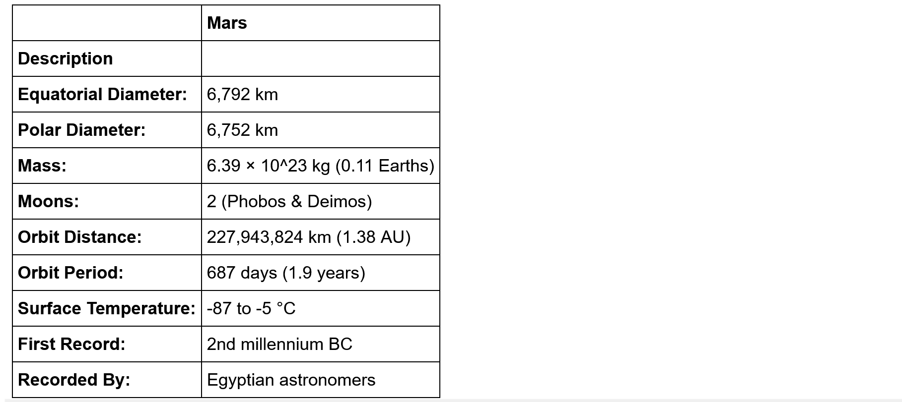

# web-scraping-challenge

In this exercise I completed a web-scraping using Jupyter Notebook, BeautifulSoup, Pandas, and Requests/Splinter.

### NASA Mars News

- I scraped the [NASA Mars News Site](https://mars.nasa.gov/news/) and collected the latest News Title and Paragraph Text. 

### JPL Mars Space Images - Featured Image

- I visited the url for JPL Featured Space Image [here](https://data-class-jpl-space.s3.amazonaws.com/JPL_Space/index.html) and used splinter to navigate the site and find the image url for the  current Featured Mars Image.

### Mars Facts

- I visited the Mars Facts webpage [here](https://space-facts.com/mars/) and used Pandas to scrape the table containing facts about the planet including Diameter, Mass, etc.

### Mars Hemispheres

- I visited the USGS Astrogeology site [here](https://astrogeology.usgs.gov/search/results?q=hemisphere+enhanced&k1=target&v1=Mars) to obtain high resolution images for each of Mars' hemispheres.
- I saved both the image url string for the full resolution hemisphere  image, and the Hemisphere title containing the hemisphere name using a Python dictionary to store the data.

------

## 

## Step 2 - MongoDB and Flask Application

I used MongoDB with Flask templating to create a new HTML page that  displays all of the information that was scraped from the URLs above.

- I started by converting the Jupyter notebook into a Python script with a function called `scrape_info` that will execute all of the scraping code from above and return one Python dictionary containing all of the scraped data.
- Next, I created a route called `/scrape` that imports the `scrape_mars.py` script and calls the `scrape_info` function and stores the return value in Mongo as a Python dictionary.
- I created a root route `/` that will query the Mongo database and pass the mars data into an HTML template to display the data.
- I created a template HTML file called `index.html` that will  take the mars data dictionary and display all of the data in the  appropriate HTML elements. 